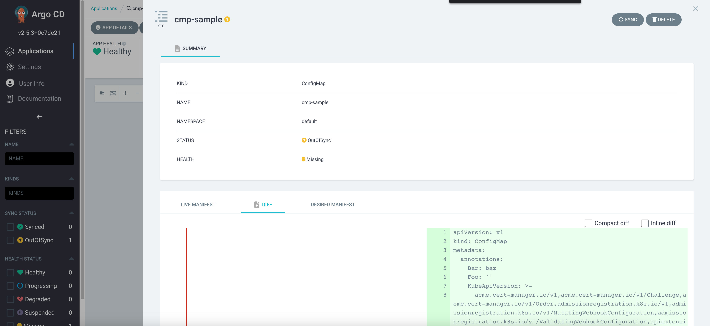

# argocd-cmp-sample

Sample for extending your ArgoCD instance with a plugin with the native `ConfigManagementPlugin` API.

This example was deployed on a [K3S](https://k3s.io/) cluster. Adjust it to your needs for OpenShift or other K8S distributions.

## Usage

This setup uses the ArgoCD [community helm chart](https://github.com/argoproj/argo-helm) and [helmfile](https://github.com/helmfile/helmfile).

Make sure that you are running in the correct Kubecontext. Then set the following environment variables.

```
export ARGOCD_HOSTNAME=argocd.example.tld
export ARGOCD_NAMESPACE=argocd
```

After this just run helmfile via

```
helmfile sync
```

or

```
helmfile template | kubectl apply -f
```

That's it!

## Use the CMP Sample

The plugin `example-plugin` expects at file with the extension `.yaml` in the folder `example-plugin` relative to your application root in your repository.

```
apiVersion: argoproj.io/v1alpha1
kind: Application
metadata:
  name: cmp-sample-app
  namespace: argocd
spec:
  destination:
    namespace: default
    server: https://cluster.example.tld:6443
  project: default
  source:
    path: .
    repoURL: https://git.example.tld/argocd-cmp-sample.git
    targetRevision: HEAD
  syncPolicy: {}
```

Instead of using plugin discovery you should also use `spec.source.plugin.name`.


